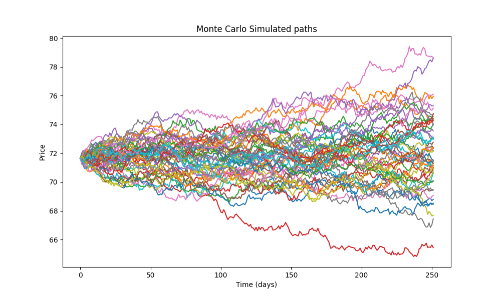

# Energy Price Monte Carlo Simulation

## Overview
This project models and simulates future energy prices using stochastic processes and Monte Carlo methods. Historical price data is used to estimate model parameters, and multiple future price paths are generated to analyse uncertainty and risk.

## Model
Price dynamics are modelled using Geometric Brownian Motion (GBM):
dS_t = μ S_t dt + σ S_t dW_t

where:
- μ is the drift
- σ is the volatility
- W_t is a Wiener process
Log returns are assumed to be normally distributed. Parameters are estimated directly from historical data

## Methodology
1. **Data Collection**
   Historical data is downloaded from Yahoo Finance
2. **Preprocessing**
   Log returns are computed: log(P_t/P_{t-1})
3. **Parameter Estimation**
   drift (μ) = mean of log returns
   Volatility (σ) = standard deviation of log returns
4. **Simulation**
   Future price paths are generated using Monte Carlo simulation:
   S_{t+dt} = S_t * exp((μ - 0.5σ^2)Δt + σsqrt(Δt)Z)
   Where Z ~ N(0,1)
5. **Analysis**
   - Expected future price
   - Confidence intervals
   - Distribution of outcomes

## Results
The simulation produces a distribution of possible future prices, allowing an estimation of the expected value, quantification of uncertainty and probability-based risk analysis.
This is the plot obtained for the monte carlo simulations:

## Future Improvements
- Vectorised simulation for performance optimisation
- More advanced time series models (ARIMA, GARCH)
- Multi-asset modelling and correlation
- Backtesting and model validation

## Technologies
- Python
- NumPy
- Pandas
- Matplotlib
- yfinance

## How to Run
‘’’bash
pip install -r Requirements.txt
Python Monte_carlo_simulation.py

## Author
Independent project focused on developing quantitative modelling and simulation skills relevant to data science and quantitative finance
